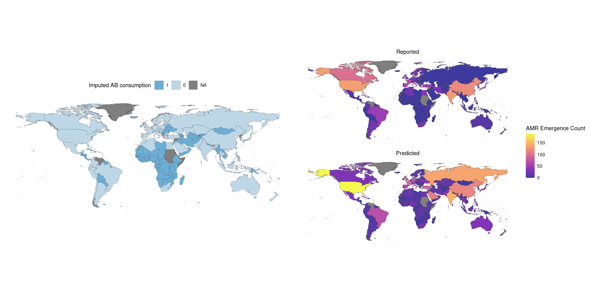

This document presents the results of a sensitivity analysis of missing value imputation for human and animal antimicrobial consumption. We evaluate four subsets of the data with varying degrees of imputation.

1) Countries with values for human AND animal antimicrobial consumption data, i.e., no imputation (n = 29)
2) Countries with values for human OR animal antimicrobial consumption data, i.e., one or the other is imputed (n = 70)
3) Countries with GDPs within the range of GDPs of countries that have both human and animal antimicrobial consumption data (n = 76). In this scenario, both human and animal consumption values can be imputed if the country GDP is within range. The figure below shows the distribution of GDPs for countries in this subset.
<!-- -->
4) All countries in the dataset, i.e., full imputation of missing values (n = 189)

All imputations in this sensitivity analysis were performed using `MICE`. To compare results across the four scenarios, we present model coefficients, marginal effect plots for three variables of interest (human antimicrobial consumption, livestock antimicrobial consumption, and the interaction between livestock antimicrobial consumption and GDP), and maps showing reported and predicted AMR emergence counts and human/livestock antimicrobial consumption imputations by country.

### Model coefficients with in-depth focus on human and livestock antimicrobial consumption effects

In the original analysis, we found a consistent negative association between livestock antimicrobial consumption and AMR events. However, interpretation of this relationship was limited due to the fact that livestock antimicrobial consumption data is sparse (n = 31) and biased towards higher income countries. To account for the potential confounding by country GDP, we have included an interaction term between livestock antimicrobial consumption and GDP. These new model results, summarized below, confirm that the association between livestock antimicrobial consumption and AMR events is negative in higher income countries, whereas no relationship is discernible in middle and low income countries. For the publication, we propose using scenario 3 for the primary analysis while also presenting the results of the full sensitivity analysis.

In scenario 1 (no imputation) none of antimicrobial consumption variables are consistent predictors of AMR emergence. In this scenario we lose too much data to detect an effect.

Scenarios 2 and 3 have similar results. Human antimicrobial consumption is a positive consistent predictor of AMR emergence. Livestock antimicrobial consumption on its own is not a predictor, but the interaction between livestock antimicrobial consumption and GDP is a consistent negative predictor of AMR emergence: higher GDP countries show a negative association between livestock antimicrobial consumption and AMR emergence, and lower GDP countries do not show strong trends. 

In scenario 4, human antimicrobial consumption is a consistent predictor, but neither livestock antimicrobial consumption nor its interaction with GDP is a consistent predictor of AMR emergence. In this case, the high degree of imputation obscures potential relationships.

##### 1. Countries with values for human AND animal antimicrobial consumption data
<!-- -->

##### 2. Countries with values for human OR animal antimicrobial consumption data
<!-- -->

##### 3. Countries with GDP values within the range of countries that have values for human\nand animal antimicrobial consumption
<!-- -->

##### 4. All countries in dataset
<!-- -->

### Maps
As desribed above, scenario 1 is limited to countries from high GDP regions. With increasing amounts of imputation (scenarios 2 through 4), more LMIC countries are incorporated into the analysis. We believe that scenario 3 brings in geographic coverage without relying too heavily on imputation.

##### 1. Countries with values for human AND animal antimicrobial consumption data
<!-- -->

##### 2. Countries with values for human OR animal antimicrobial consumption data
<!-- -->

##### 3. Countries with GDP values within the range of countries that have values for human\nand animal antimicrobial consumption
<!-- -->

##### 4. All countries in dataset
<!-- -->

