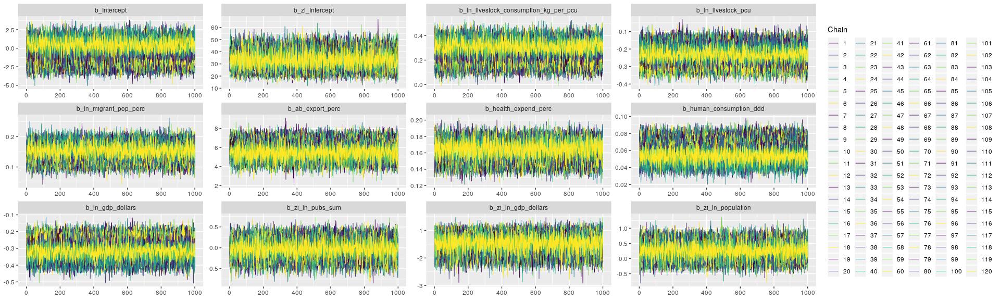
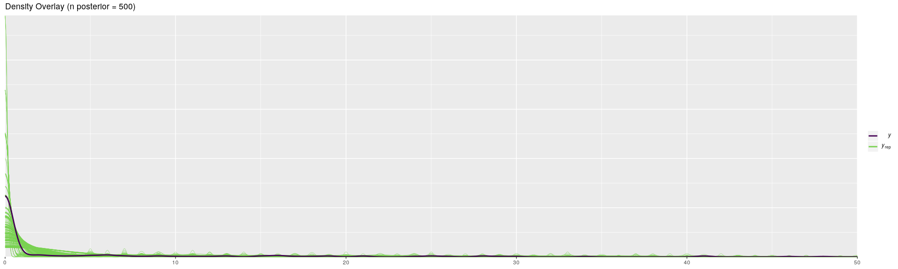
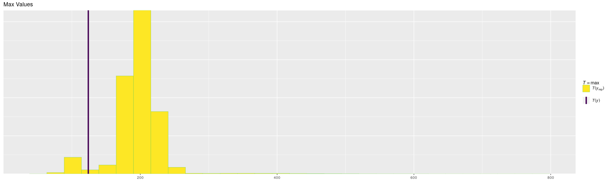
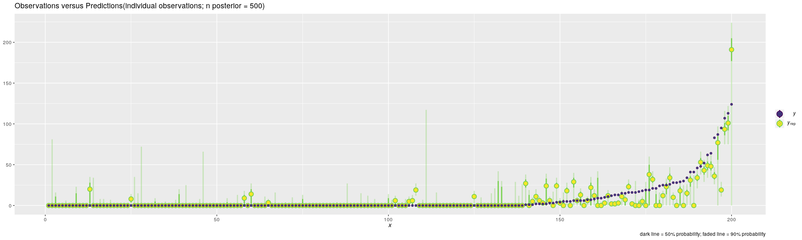
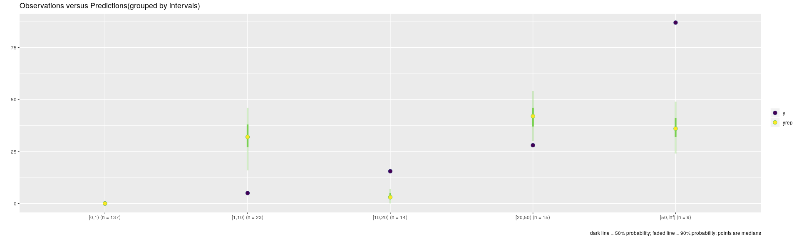
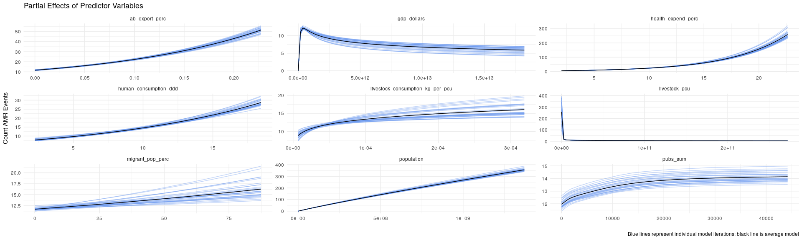
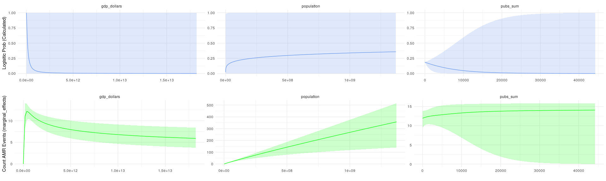
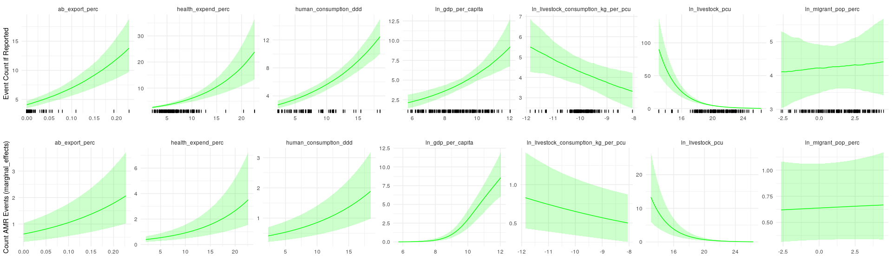

```
##  Family: zero_inflated_poisson 
##   Links: mu = log; zi = logit 
## Formula: n_amr_events ~ ln_livestock_consumption_kg_per_pcu + ln_livestock_pcu + ln_migrant_pop_perc + ab_export_perc + health_expend_perc + human_consumption_ddd + ln_gdp_dollars + offset(ln_population) 
##          zi ~ ln_pubs_sum + ln_gdp_dollars + ln_population
##    Data: country_mice (Number of observations: 200) 
## Samples: 120 chains, each with iter = 4000; warmup = 2000; thin = 1;
##          total post-warmup samples = 240000
## 
## Population-Level Effects: 
##                                     Estimate Est.Error l-95% CI u-95% CI
## Intercept                              -0.57      1.16    -2.73     1.76
## zi_Intercept                           33.23      5.93    22.35    45.59
## ln_livestock_consumption_kg_per_pcu     0.26      0.07     0.12     0.39
## ln_livestock_pcu                       -0.24      0.05    -0.33    -0.14
## ln_migrant_pop_perc                     0.15      0.02     0.10     0.19
## ab_export_perc                          5.77      0.74     4.28     7.18
## health_expend_perc                      0.16      0.01     0.14     0.18
## human_consumption_ddd                   0.06      0.01     0.04     0.08
## ln_gdp_dollars                         -0.30      0.05    -0.40    -0.21
## zi_ln_pubs_sum                         -0.03      0.18    -0.38     0.33
## zi_ln_gdp_dollars                      -1.48      0.27    -2.04    -0.99
## zi_ln_population                        0.27      0.23    -0.18     0.72
##                                     Eff.Sample Rhat
## Intercept                                  147 1.31
## zi_Intercept                            195378 1.00
## ln_livestock_consumption_kg_per_pcu        154 1.29
## ln_livestock_pcu                           120 1.42
## ln_migrant_pop_perc                        312 1.12
## ab_export_perc                             515 1.07
## health_expend_perc                        1202 1.03
## human_consumption_ddd                      163 1.26
## ln_gdp_dollars                             124 1.40
## zi_ln_pubs_sum                          215109 1.00
## zi_ln_gdp_dollars                       193443 1.00
## zi_ln_population                        226801 1.00
## 
## Samples were drawn using sampling(NUTS). For each parameter, Eff.Sample 
## is a crude measure of effective sample size, and Rhat is the potential 
## scale reduction factor on split chains (at convergence, Rhat = 1).
```

<!-- --><!-- --><!-- --><!-- --><!-- -->

<!-- --><!-- --><!-- -->

