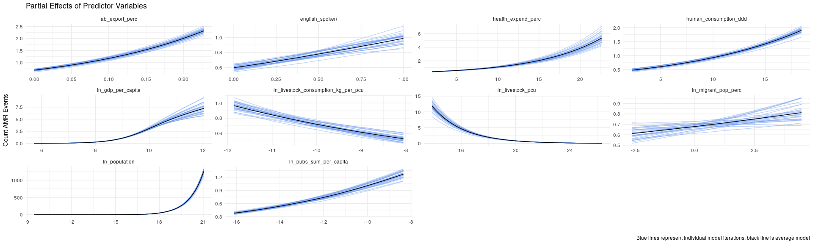
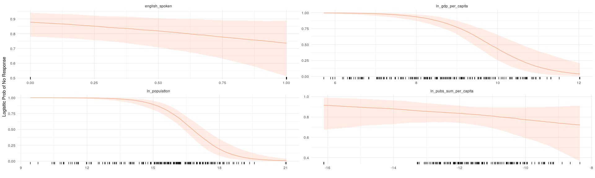
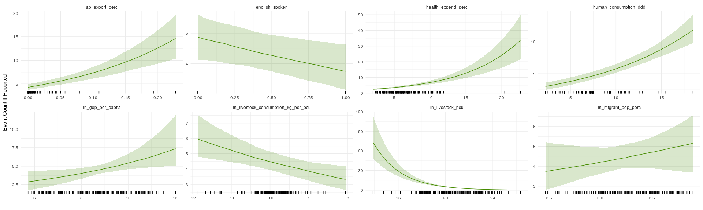
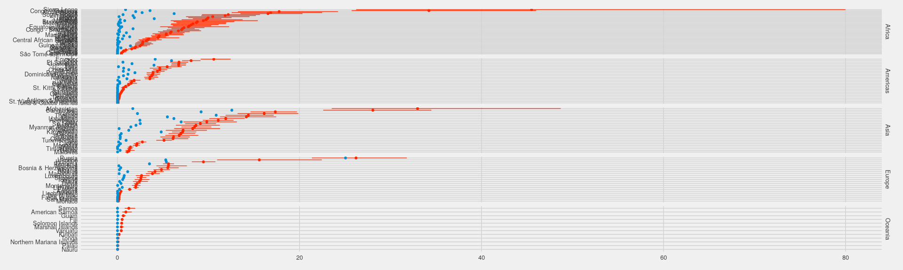
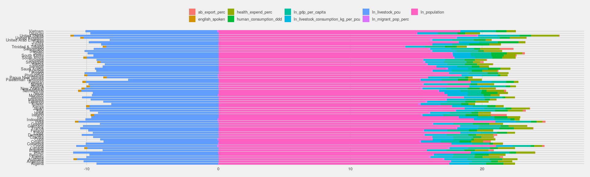

```
##  Family: zero_inflated_poisson 
##   Links: mu = log; zi = logit 
## Formula: n_amr_events ~ ln_livestock_consumption_kg_per_pcu + ln_livestock_pcu + ln_migrant_pop_perc + ab_export_perc + health_expend_perc + human_consumption_ddd + english_spoken + ln_gdp_per_capita + offset(ln_population) 
##          zi ~ ln_pubs_sum_per_capita + ln_gdp_per_capita + ln_population + english_spoken
##    Data: data[[i]] (Number of observations: 198) 
## Samples: 120 chains, each with iter = 2000; warmup = 1000; thin = 1;
##          total post-warmup samples = 120000
## 
## Population-Level Effects: 
##                                     Estimate Est.Error l-95% CI u-95% CI
## Intercept                              -9.45      0.91   -11.20    -7.67
## zi_Intercept                           31.11      6.21    19.64    44.05
## ln_livestock_consumption_kg_per_pcu    -0.16      0.05    -0.26    -0.06
## ln_livestock_pcu                       -0.43      0.03    -0.48    -0.38
## ln_migrant_pop_perc                     0.04      0.04    -0.03     0.11
## ab_export_perc                          5.35      0.72     3.92     6.73
## health_expend_perc                      0.13      0.01     0.10     0.15
## human_consumption_ddd                   0.08      0.01     0.07     0.10
## english_spoken                         -0.24      0.10    -0.43    -0.05
## ln_gdp_per_capita                       0.16      0.06     0.03     0.28
## zi_ln_pubs_sum_per_capita              -0.19      0.20    -0.60     0.19
## zi_ln_gdp_per_capita                   -1.46      0.28    -2.04    -0.95
## zi_ln_population                       -1.22      0.21    -1.67    -0.82
## zi_english_spoken                      -0.91      0.62    -2.16     0.28
##                                     Eff.Sample Rhat
## Intercept                                  200 1.20
## zi_Intercept                             82278 1.00
## ln_livestock_consumption_kg_per_pcu        251 1.15
## ln_livestock_pcu                           192 1.21
## ln_migrant_pop_perc                        153 1.29
## ab_export_perc                            4006 1.01
## health_expend_perc                         286 1.13
## human_consumption_ddd                      243 1.16
## english_spoken                             142 1.32
## ln_gdp_per_capita                          127 1.38
## zi_ln_pubs_sum_per_capita               115023 1.00
## zi_ln_gdp_per_capita                     88745 1.00
## zi_ln_population                         81050 1.00
## zi_english_spoken                         2744 1.01
## 
## Samples were drawn using sampling(NUTS). For each parameter, Eff.Sample 
## is a crude measure of effective sample size, and Rhat is the potential 
## scale reduction factor on split chains (at convergence, Rhat = 1).
```

<!-- --><!-- --><!-- --><!-- --><!-- -->

<!-- --><!-- --><!-- -->

<!-- --><!-- -->

